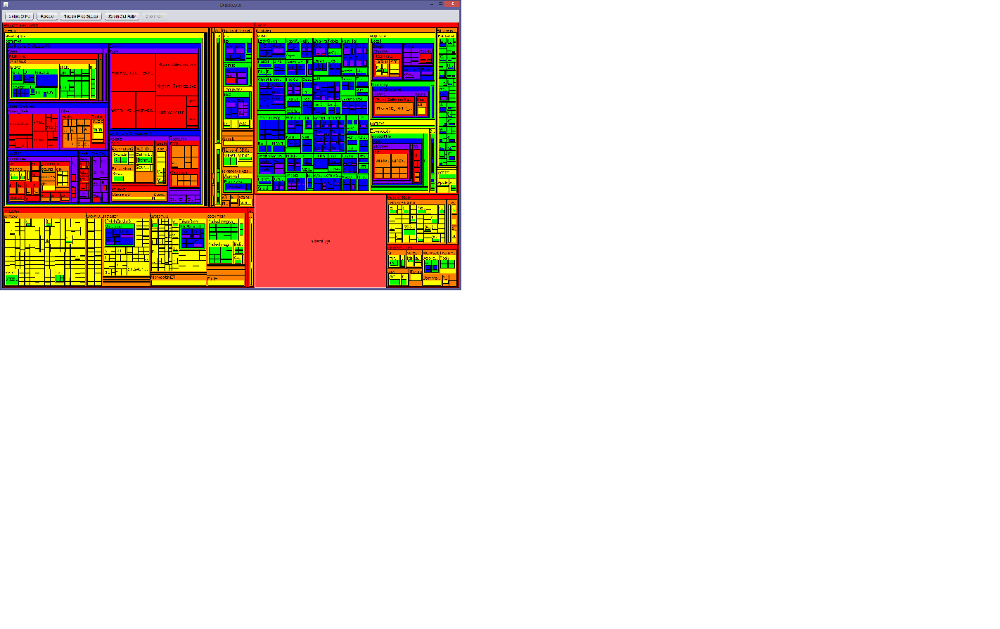

# DiskRover
Scans a storage drive and builds an interactive map of files by file size.

Visually see which folders and files are taking up the most space in your filesystem. Tested on Windows 7, Windows 8.1, CentOS, and macOS Sierra. 

Download link: 
https://github.com/kriscode1/DiskRover/blob/master/dist/DiskRover.jar

If you cannot open jar files (because Java is not installed), download Java here first: http://www.oracle.com/technetwork/java/javase/downloads/jre8-downloads-2133155.html

Inspired by SpaceMonger v1.4.0 by Sean Werkema.

(image is low-res)
